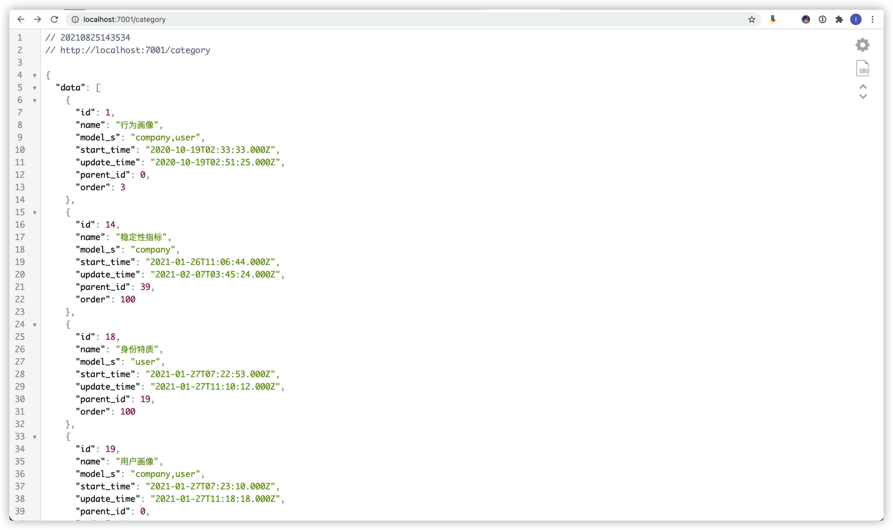
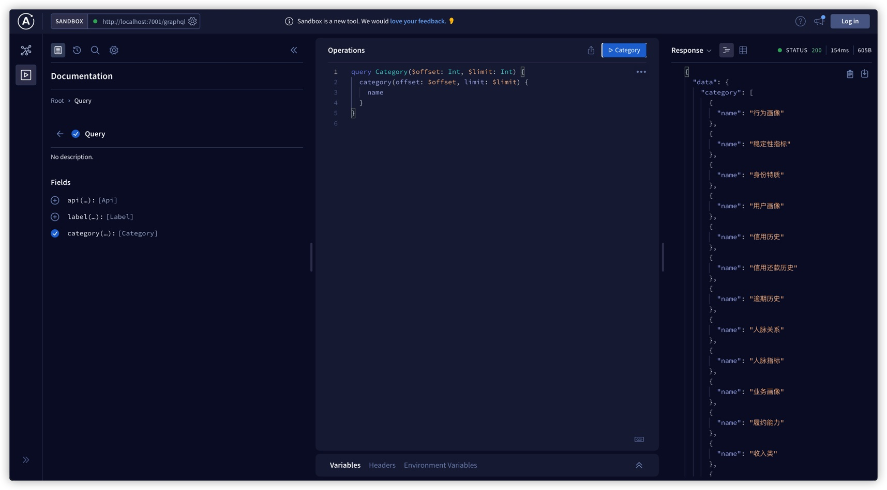
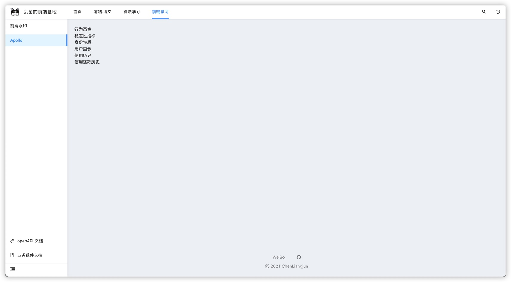

# Node+Mysql实践

## 前言

我们用Node作为后端服务的时候，最常见的一个需求就是对数据库进行CURD，做增删改查等一系列操作。

本节我们将以Mysql为例，用几种不同的方式，从简单到稍微复杂去演示，最后结合前端完善整个数据使用的闭环。涉及到的知识/库有mysql2，sequelize和graphql。

## 前置工作：用Koa搭建一个后端的基础服务框架

鉴于这次我们主要介绍的不是Koa，所以我们不会花很多笔墨在这，当然你也可以用egg.js或者用express

```javascript
// app.js
const Koa = require('koa')
const router = require('./funcs/route')

const app = new Koa()
const bodyParser = require("koa-bodyparser")

app.use(bodyParser())
app.use(router.routes())

app.listen({ port: 7001 }, () => {
  console.log(`🚀 Server ready at http://localhost:7001`)
})
```

上面中的`const router = require('./funcs/route');`我们在funcs目录下封装了一个route.js，里面主要做了两件事情：

1. 以约定式路由的方式分析routes目录下的所有js文件拿到路由配置
2. 每个文件中以get/post命名的函数路由名就是文件名，其他函数会用`/`分割并拼接在文件名后

```javascript
// funcs/route.js

const fs = require("fs")
const Router = require("koa-router")
const router = new Router()

const rootPath = `${__dirname}/..`

// 加载/routes目录下的路由
let fileList = fs.readdirSync(`${rootPath}/routes`)
fileList.forEach((v) => {
  if (!v.startsWith(".") && !v.endsWith(".test.js")) {
    let routeName = v.substring(0, v.lastIndexOf('.')) //路由名
    let routePath = `${rootPath}/routes/${v}`
    let route = require(routePath);
    let urlPath
    Object.keys(route).map(v => {
      urlPath = v.match(/get|post/) ? `/${routeName}` : `/${routeName}/${v}`
      if (-1 === ['post'].indexOf(v)) {
        router.get(urlPath, route[v]);
      } else {
        router.post(urlPath, route[v]);
      }
    })
  }
})

module.exports = router
```

现在我们就可以开始在/routes目录下新建路由文件与mysql的交互了，一般来说也就是开始写接口了。

## [mysql2](https://github.com/sidorares/node-mysql2)的基本用法

使用mysql2跟数据库交互代码写起来是非常底层的，因为你的CURD操作就是直接用的SQL语句。由于它自带Promise包装器，所以能用async/await来写。

首先我们的第一步是简单封装与mysql数据库建立连接的模块，放在项目根目录的/funcs/connect.js

```javascript
// funcs/connect.js

const mysql = require('mysql2/promise');

module.exports = async () => {
  return await mysql.createConnection({
    host: process.env.SCF_MYSQL_HOST,
    port: process.env.SCF_MYSQL_PORT || 3306,
    user: process.env.SCF_MYSQL_USER,
    password: process.env.SCF_MYSQL_PASSWORD,
    database: process.env.SCF_MYSQL_DATABASE,
    connectTimeout: 30000
  });
};
```

### 简单的案例

Mysql2 提供了`execute`方法

现在去routes目录下创建一个category.js，要在mysql数据库中表名为tms_category的表进行查询，我们可以这么操作（文件名根据需求最好能见名识意）

```javascript
const connect = require('../funcs/connect')

module.exports = {
  get: async ctx => {
    const connection = await connect();
    const [category] = await connection.execute(`SELECT * FROM tms_category`);
    let data = category
    ctx.body = {
      data: data,
      success: true,
      total: data.length
    }
    connection.close();
  }
}
```

至此，一个简单的接口就写好了，我们`node app.js`启动服务之后，直接在浏览器输入`http://localhost:7001/category`，就可以看到我们mysql数据库中要查询的表中的所有数据，这里我在测试的`tms_category`表中加入部分类别的测试数据，结果



## ORM

刚刚我们举的例子中，`tms_category`其实是一张二维表

```bash
mysql> select * from tms_category;
+----+--------------------+--------------+---------------------+---------------------+-----------+-------+
| id | name               | model_s      | start_time          | update_time         | parent_id | order |
+----+--------------------+--------------+---------------------+---------------------+-----------+-------+
|  1 | 行为画像           | company,user | 2020-10-19 10:33:33 | 2020-10-19 10:51:25 |         0 |     3 |
| 14 | 稳定性指标         | company      | 2021-01-26 19:06:44 | 2021-02-07 11:45:24 |        39 |   100 |
| 18 | 身份特质           | user         | 2021-01-27 15:22:53 | 2021-01-27 19:10:12 |        19 |   100 |
| 19 | 用户画像           | company,user | 2021-01-27 15:23:10 | 2021-01-27 19:18:18 |         0 |     1 |
| 25 | 信用历史           | company,user | 2021-01-29 17:02:29 | 2021-01-29 17:02:29 |        19 |   100 |
| 26 | 信用还款历史       | company,user | 2021-01-29 17:03:38 | 2021-01-29 17:03:38 |        25 |   100 |
| 27 | 逾期历史           | company,user | 2021-01-30 12:43:43 | 2021-01-30 12:43:43 |        25 |   100 |
| 28 | 人脉关系           | user         | 2021-01-30 12:58:31 | 2021-01-30 12:58:31 |        19 |   100 |
| 29 | 人脉指标           | user         | 2021-01-30 13:49:25 | 2021-01-30 13:49:25 |        28 |   100 |
| 30 | 业务画像           | company,user | 2021-01-30 13:52:43 | 2021-01-30 13:52:43 |         0 |     2 |
| 31 | 履约能力           | company,user | 2021-01-30 13:55:44 | 2021-01-30 13:55:44 |        30 |   100 |
| 32 | 收入类             | company,user | 2021-01-30 13:56:07 | 2021-01-30 13:56:07 |        31 |   100 |
| 33 | 固定资产           | company      | 2021-01-30 13:57:38 | 2021-01-30 13:57:38 |        31 |     1 |
| 34 | 支出类             | company      | 2021-01-30 13:57:56 | 2021-01-30 13:57:56 |        31 |   100 |
| 35 | 业务能力           | company,user | 2021-01-30 14:00:10 | 2021-02-07 12:05:37 |        30 |   100 |
| 36 | 运力指标           | company,user | 2021-01-30 14:00:45 | 2021-01-30 14:00:45 |        35 |   100 |
| 37 | 运输能力           | company,user | 2021-01-30 14:00:59 | 2021-02-07 12:01:27 |        35 |   100 |
| 38 | 管理能力           | company      | 2021-01-30 14:08:23 | 2021-02-07 12:03:36 |        35 |   100 |
| 39 | 企业特质           | company      | 2021-02-07 11:44:45 | 2021-02-07 11:44:45 |        19 |     1 |
| 40 | 合作关系           | company      | 2021-02-07 11:45:50 | 2021-02-07 11:45:50 |        19 |   100 |
| 42 | 合作指标           | company      | 2021-02-07 11:55:06 | 2021-02-07 11:55:06 |        40 |   100 |
| 45 | 个人指标           | user         | 2021-02-07 14:42:21 | 2021-02-07 14:42:21 |        18 |   100 |
| 48 | zly                | company,user | 2021-08-06 17:07:50 | 2021-08-06 17:07:50 |        47 |   100 |
| 49 | company            | company,user | 2021-08-06 17:33:10 | 2021-08-06 17:33:10 |         1 |   100 |
| 50 | zly5               | company      | 2021-08-06 17:33:25 | 2021-08-06 17:34:40 |        49 |   100 |
+----+--------------------+--------------+---------------------+---------------------+-----------+-------+
25 rows in set (0.00 sec)
```

每一行我们其实都可以用一个对象来表示

```json
{
  "id": 1,
  "name": "行为画像",
  "model_s": "company,user",
  "start_time": "2020-10-19T02:33:33.000Z",
  "update_time": "2020-10-19T02:51:25.000Z",
  "parent_id": 0,
  "order": 3,
},
```

这其实就是ORM：Object-Relational Mapping，把关系数据库的表结构映射到对象上。是不是很简单？

### 用[Sequelize](https://www.sequelize.com.cn/)查询mysql

Sequelize就是这样一个基于 promise 的 Node.js的ORM。我们读写的都是JavaScript对象，Sequelize帮我们把对象映射到数据库中的行。接下来我们开始对其进行封装。

```javascript
// data/index.js
const { Sequelize } = require('sequelize')

const sequelize = new Sequelize(process.env.SCF_MYSQL_DATABASE, process.env.SCF_MYSQL_USER, process.env.SCF_MYSQL_PASSWORD, {
  host: process.env.SCF_MYSQL_HOST,
  dialect: 'mysql',
  timezone: '+08:00',
  define: {
    freezeTableName: true
  }
});

module.exports = sequelize;
```

Sequelize是ES6中的类，它的本质是模型（Model），模型是代表数据库中表的抽象。使用它的过程中最重要的一步就是进行模型定义了，我们在data目录里创建一个category.js文件来将category的模型作为一个模块导出

```javascript
const { DataTypes } = require("sequelize")
const sequelize = require("./index")

const Category = sequelize.define("tms_category", {
  // 在这里定义模型属性
  id: {
    type: DataTypes.INTEGER,
    autoIncrement: true,
    primaryKey: true,
  },
  name: DataTypes.TEXT,
  model_s: DataTypes.TEXT,
  parent_id: DataTypes.INTEGER,
  order: DataTypes.INTEGER
}, {
  // 这是其他模型参数
  freezeTableName: true,
  timestamps: true,
  createdAt: 'start_time',
  updatedAt: 'update_time',
})

module.exports = Category
```

默认情况下,当未提供表名时,Sequelize 会自动将模型名复数并将其用作表名，你可以使用 `freezeTableName: true` 参数停止 Sequelize 执行自动复数化。这样，Sequelize 将推断表名称等于模型名称，而无需进行任何修改。

接下来我们可以回去编写接口了

```javascript
// routes/category.js
const connect = require('../funcs/connect')
const category = require('../data/category');

module.exports = {
  get: async ctx => {
    const connection = await connect();
    const [category] = await connection.execute(`SELECT * FROM tms_category`);
    let data = category
    ctx.body = {
      data: data,
      success: true,
      total: data.length
    }
    connection.close();
  },
	//这里是我们根据sequelize新增的函数
  sequelize: async ctx => {
    const result = await category.findAll({
      // attributes: ['name']
    });
    ctx.body = {
      success: true,
      data: result
    }
  }
}
```

如果需要选择某些特定属性,可以使用 `attributes` 参数，至于其其他查询以及update，delete等其他用法，可以去[Sequelize中文文档](https://www.sequelize.com.cn/core-concepts/model-querying-basics)中查看。

最后访问`http://localhost:7001/category/sequelize`看到的结果跟使用mysql2是一样的。

## [GraphQL](https://graphql.cn)

最后我们提一下GraphQL，它是一种针对 Graph（图状数据）进行查询特别有优势的 Query Language（查询语言），它的介绍我觉得知乎「[什么是GraphQL？](https://www.zhihu.com/question/264629587)」这个回答说的很好。

既然上文提到了Sequelize，那么我们不妨就结合GraphQL来体验一下。首先我们先在前文的基础上提一个新的需求：

> 假设category接口已经写好了，在A页面我们需要用这个接口的所有数据。现在有一个新页面B，但是这个页面我们只需要用到这个接口中的`name`字段，其他数据都不要返回给我，不允许通过新增加一个接口的方式实现。

当然你可能会在category的中加一个逻辑判断，让前端调用的时候传一个参数flag进来，根据这个参数来返回不同数据。这当然是可以的。但是真实场景肯定比这个要复杂得多。这里我们选择用GraphQL。

在Node使用GraphQL，我们可以用apollo-server-koa，graphql这两个库结合上文提到的sequelize来使用。

### [apollo-server](https://github.com/apollographql/apollo-server)

Apollo-server是一个开源的 GraphQL 服务器。它适用于许多 Node.js HTTP 服务器框架，或者可以使用内置的 Express 服务器独立运行。其中有几个地方需要我们提一下：

- schema 层用于强类型定义 需要进行查询或更新的gql的数据类型， 层级结构
- resolvers层用于执行有映射关系的gql, 并将结果存入model层中对应的model里面

对于koa框架，我们可以用apollo-server-koa库，注意如果版本在3.*以上，需要用到async不然会报错，这里我用的apollo-server-koa版本是3.1.2。

首先我们需要修改入口文件app.js，由于apollo

```javascript
// app.js

const Koa = require("koa")
const router = require("./funcs/route")
const { ApolloServer } = require("apollo-server-koa")
const { schema } = require("./data/schema")

async function startApollo() {
  const server = new ApolloServer({
    schema,
  })
  await server.start()
  const app = new Koa()

  server.applyMiddleware({ app })
  app.use(router.routes())
  app.listen({ port: 7001 }, () => {
    console.log(`🚀 Server ready at http://localhost:7001`)
  })
}
startApollo()
```

然后我们在data目录下新建一个schema.js文件用于类型定义

```javascript
const { schema: category} = require('./category')
const {
  GraphQLSchema,
  GraphQLObjectType,
} = require('graphql');
const query = new GraphQLObjectType({
  name: 'Query',
  fields: {
    category
  }
});
const schema = new GraphQLSchema({query});

module.exports = {
  schema
};
```

最后我们回到sequelize介绍里建的data/category.js文件进行修改，将graphql和sequelize结合起来

```javascript
const { DataTypes } = require("sequelize")
const sequelize = require("./index")
const { GraphQLObjectType, GraphQLList } = require("graphql")
const {
  resolver,
  attributeFields,
  defaultListArgs,
} = require("graphql-sequelize")

const Category = sequelize.define(
  "tms_category",
  {
    id: {
      type: DataTypes.INTEGER,
      autoIncrement: true,
      primaryKey: true,
    },
    name: DataTypes.TEXT,
    model_s: DataTypes.TEXT,
    parent_id: DataTypes.INTEGER,
    order: DataTypes.INTEGER,
  },
  {
    freezeTableName: true,
    timestamps: true,
    createdAt: "start_time",
    updatedAt: "update_time",
  }
)

//这里是新增的代码部分
const type = new GraphQLObjectType({
  name: "Category",
  fields: { ...attributeFields(Category) },
})
const schema = {
  type: new GraphQLList(type),
  resolve: resolver(Category),
  args: defaultListArgs(),
}
const category = Category
module.exports = {
  category,
  schema,
}

```

这样我们就能在`http://localhost:7001/graphql`看到效果了



### GraphQL数据前端调用

前端的话，我们可以用apollo/client来发起请求，其对React和Vue都是支持的，这里以React作为例子

首先在一个新的组件目录下，比如名为apollo，新建service.ts，建立与apollo的连接

```typescript
// apollo/service.ts
// 注意这里的/api是我们通过代理到后端的地址，实际地址是127.0.0.1:7001/graphql

import { ApolloClient, ApolloLink, HttpLink, InMemoryCache } from '@apollo/client';

const client = new ApolloClient({
  link: ApolloLink.from([
    new HttpLink({
      uri: '/api/graphql',
      useGETForQueries: true,
    }),
  ]),
  cache: new InMemoryCache(),
});

export default client;

```


然后新建index.tsx

```typescript
// apollo/index.tsx

import React from 'react'
import { ApolloProvider } from '@apollo/client/react';
import client from './service';
import Apollo from './apollo';

export default function index() {
  return (
    <div>
      <ApolloProvider client={client}>
        <Apollo />
      </ApolloProvider>
    </div>
  )
}

```

ApolloProvider类似于React中的Context.Provider，它会把apollo客户端放入到React app的上下文里，在组件树的任何地方都是可以获取到apollo客户端。

子组件Apollo

```typescript
import React from 'react'
import { useQuery, gql } from '@apollo/client';

export default function Apollo() {
  const { data } = useQuery(
    gql`
      query test($offset: Int, $limit: Int) {
        category(offset: $offset, limit: $limit) {
          name
        }
      }
    `,
    {
      variables: {
        offset: 0,
        limit: 6,
      },
    },
  );
  const { category } = data || {}
  return (
    <div>
      {category ? (
        category.map(v => (
          <div>{v.name}</div>
        ))
      ):
      '没有数据'}
    </div>
  )
}

```

这里结合useQuery使用我们就会发现跟在刚刚的web页面上是差不多的了。至此我们就完成了整个的流程。最后前端得到的数据如图：



如果你是刚接触想快速对GraphQL有更多的了解，github上有一篇「[爱GraphQL胜过REST](https://github.com/xitu/gold-miner/blob/master/article/2020/loving-graphql-more-than-rest.md)」可以帮助到你。