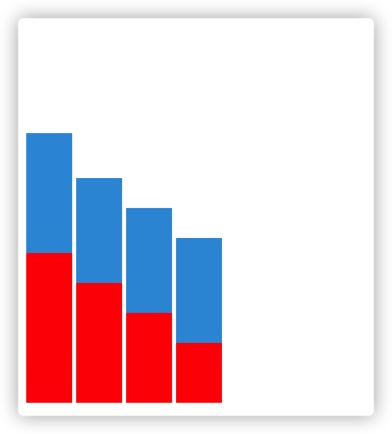

# HTML和CSS实现可视化

## 前言

可视化的本质是什么？一句话来说，就是将数据信息组织起来后，以图形的方式呈现出来。

在 Web 上，图形通常是通过浏览器绘制的。现代浏览器是一个复杂的系统，其中负责绘制图形的部分是渲染引擎。而渲染引擎绘制图形的方式，大体上有 4 种。

第 1 种是传统的 HTML+CSS。这种方式通常用来呈现普通的 Web 网页。

第 2 种是使用 SVG。SVG 和传统的 HTML+CSS 的绘图方式差别不大。只不过，HTML 元素在绘制矢量图形方面的能力有些不足，而 SVG 恰好弥补了这方面的缺陷。

第 3 种是使用 Canvas2D。这是浏览器提供的 Canvas API 中的其中一种上下文，使用它可以非常方便地绘制出基础的几何图形。在可视化中，Canvas 比较常用。

第 4 种是使用 WebGL。这是浏览器提供的 Canvas API 中的另一种上下文，它是 OpenGL ES 规范在 Web 端的实现。我们可以通过它，用 GPU 渲染各种复杂的 2D 和 3D 图形。值得一提的是，WebGL 利用了 GPU 并行处理的特性，这让它在处理大量数据展现的时候，性能大大优于前 3 种绘图方式。因此，在可视化的应用中，一些数据量大、视觉效果要求高的特殊场景，使用 WebGL 渲染是一种比较合适的选择。

针对WebGL。Chrome94开始，WebGPU值得一提。它为Web应用提供了直接使用GPU的能力，可以用于加速3D渲染以及数据并行计算，为Web应用在游戏以及人工智能领域打开了另外一扇窗。WebGPU得到了各个主流浏览器的支持，因此成为W3C标准只是时间问题。不过，Chrome 94只是开始试用（origin trial），正式发布要等到Chrome 98，时间大概是明年2月份。

WebGPU是WebGL的继承者，它们的目标类似，不过WebGPU提供了更加底层的GPU能力。因此，WebGPU的图像渲染能力更强，性能更好，更易用，也更加适用于数据并行计算以及机器学习。

而且根据Safari的测试结果，WebGPU的性能在各种设备上都远高于WebGL。所以说，未来前端可视化很重要的一个领域，必是WebGPU无疑。

## HTML,CSS实现可视化

下面我们进入正题，使用第一种方式，HTML+CSS，实现一些简单的可视化图表。它的好处是：

1. 用 CSS 来实现很有好处，既能简化开发，又不需要引入额外的库，可以节省资源，提高网页打开的速度。
2. 理解 CSS 的绘图思想对于可视化也是很有帮助的，比如，CSS 的很多理论就和视觉相关，可视化中都可以拿来借鉴。

### 柱状图

用CSS实现柱状图非常简单，主要使用的是线性渐变(Linear-gradient)，同时配合网格布局(Grid)，直接上代码：

```html
<!DOCTYPE html>
<html lang="en">
<style>
  .bargraph {
    margin-top: 100px;
    display: grid;
    width: 200px;
    height: 300px;
    grid-template-columns: repeat(4, 25%);
  }
  .bargraph div {
    margin: 0 2px;
  }
  .bargraph div:nth-child(1) {
    background: linear-gradient(to bottom, transparent 10%, #3498db 10% 50%, #f00 50% 100%);
  }
  .bargraph div:nth-child(2) {
    background: linear-gradient(to bottom, transparent 25%, #3498db 25% 60%, #f00 60% 100%);
  }
  .bargraph div:nth-child(3) {
    background: linear-gradient(to bottom, transparent 35%, #3498db 35% 70%, #f00 70% 100%);
  }
  .bargraph div:nth-child(4) {
    background: linear-gradient(to bottom, transparent 45%, #3498db 45% 80%, #f00 80% 100%);
  }
</style>
<body>
  <div class="bargraph">
    <div></div>
    <div></div>
    <div></div>
    <div></div>
  </div>
</body>
</html>
```

