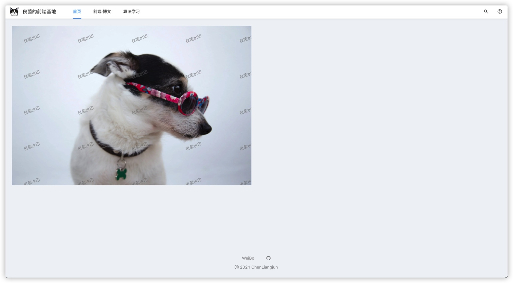
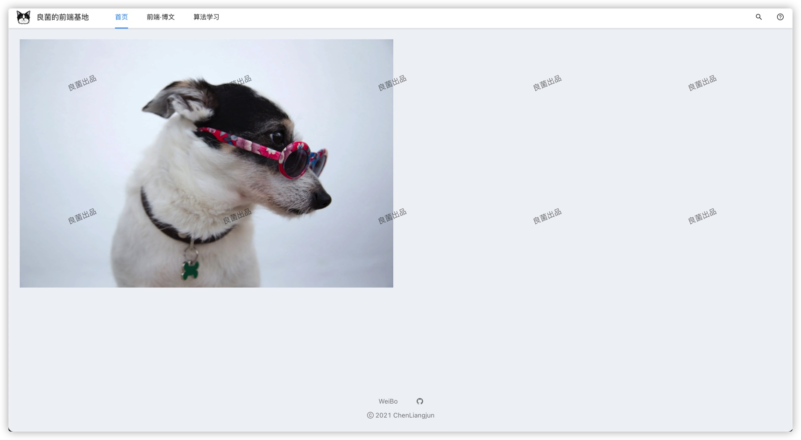

# 前端如何给图片加水印？

## 前言

如今的互联网资源之丰富，只要你想找的，几乎就没有找不到的，数据传播的便捷性和隐蔽性，让数据安全成为一个很重要的课题。因此为了防止数据的泄露，我们常常需要给数据加个“签名”，这样一来可以保证自己是资料的“版权方”，二来在对方在泄露时也会迫于水印而有所顾忌，达到**不战而屈人之兵的效果**。

另一方面的话加水印也能通过提高自己的曝光率从而达到数据增长的效果。最常见的就是给图片加水印了。微博吃瓜的时候一张一手的照片如果带上了自己的水印，传播得越广水印信息的曝光率也就提高了，许多MCN公司或者狗子队用的就是这种方式。

## 实现方式

水印的实现方式根据实现方式可以分为前端水印和后端水印。

前端水印的优点可以总结为三点，第一，可以不占用服务器资源，完全依赖客户端的计算能力，减少服务端压力。第二，速度快，无论哪种前端的实现方式，性能都是优于后端的。第三，实现方式简单。后端实现水印的最大优势就是安全。知乎，微博都是采用后端实现的水印方案。

下面我们主要介绍前端图片水印的方式。之后也会介绍 nodejs 怎么实现后端图片水印。

## 自己动手封装图片水印组件

我们的方案是封装一个React版的组件。

在动手之前我们需要知道的是，由于我们是在前端给图片加水印的，那就很难做到“无懈可击”了。右键图片复制我们可以通过禁止右键来破解，如何禁止呢？可以通过CSS的方式，用一个绝对定位的块级元素"挡住"这张图片，这个元素的大小等于图片，然后给这个元素设置一个有透明度的背景，而这个背景就是我们要加的水印。这样的话右键图片实际右键的就是这个背景元素，达到禁止右键保存图片同时加水印的效果了。

Talk is cheap.Show me the code.

```typescript
// components/MyWaterMark/index.tsx

import React, { useState } from 'react'
import { Spin } from 'antd';
import styles from './index.less';

export const MyWaterMark = (props) => {
  // 获取水印数据
  const boxRef = React.createRef();
  const [waterMarkStyle, setWaterMarkStyle] = useState('180px 120px');
  const [isError, setIsError] = useState(false);
  const {
    src, text = `良菌水印`
  } = props;
  // 设置背景图和背景图样式
  const boxStyle = {
    backgroundSize: waterMarkStyle,
    backgroundImage: `url("data:image/svg+xml;utf8,<svg width=\'100%\' height=\'100%\' xmlns=\'http://www.w3.org/2000/svg\' version=\'1.1\'><text width=\'100%\' height=\'100%\' x=\'20\' y=\'68\'  transform=\'rotate(-20)\' fill=\'rgba(0, 0, 0, 0.4)\' font-size=\'14\' stroke=\'rgba(255, 255, 255, .2)\' stroke-width=\'1\'>${text}</text></svg>")`,
  };
  const onLoad = (e) => {
    const dom = e.target;
    const {
      previousSibling, nextSibling, offsetLeft, offsetTop,
    } = dom;
    // 获取图片宽高
    const { width, height } = getComputedStyle(dom);
    if (parseInt(width.replace('px', '')) < 180) {
      setWaterMarkStyle(`${width} ${height.replace('px', '') / 2}px`);
    };
    previousSibling.style.height = height;
    previousSibling.style.width = width;
    previousSibling.style.position = 'absolute'
    previousSibling.style.top = `${offsetTop}px`;
    previousSibling.style.left = `${offsetLeft}px`;
    // 加载 loading 隐藏
    nextSibling.style.display = 'none';
  };
  const onError = (event) => {
    setIsError(true);
  };
  return (
    <div className={styles.water_mark_wrapper} ref={boxRef}>
      <div className={styles.water_mark_box} style={boxStyle} />
      {isError
        ? <div />
        : (
          <>
            
            <Spin className="loading-wrapper" />
          </>
        )
      }
    </div>
  );
};

```

使用

```typescript
import React from 'react';
import { MyWaterMark } from '@/components/MyWaterMark';

export default (): React.ReactNode => {
  return (
    <>
    <MyWaterMark src='https://images.pexels.com/photos/1629777/pexels-photo-1629777.jpeg?auto=compress&cs=tinysrgb&dpr=2&h=750&w=1260' />
    </>
  );
};

```

最终效果



## 使用ProComponents的WaterMark组件

前面我们是自己封装了一个水印组件，我们看看用市场上现有封装好的组件的效果如何。这里用[ProComponents](https://procomponents.ant.design)的[水印组件](https://procomponents.ant.design/components/water-mark)，它是一个是基于 Ant Design 而开发的模板组件，提供了更高级别的抽象支持，开箱即用。一般在用Ant Design Pro中会经常用到。使用起来非常方便高效。

```typescript
import React from 'react';
import { WaterMark } from '@ant-design/pro-layout';

export default (): React.ReactNode => {
  return (
    <>
    <WaterMark content='良菌出品' fontColor='rgba(0,0,0,.4)	'>
       e.preventDefault()}></img>
    </WaterMark>
    </>
  );
};
```

最终的效果是大同小异的



 接下来我们看一下源码，瞧瞧它是怎么实现的

```javascript
var WaterMark = function WaterMark(props) {
  // ......

  (0, _react.useEffect)(function () {
    var canvas = document.createElement('canvas');
    var ctx = canvas.getContext('2d');
    var ratio = getPixelRatio(ctx);
    var canvasWidth = "".concat((gapX + width) * ratio, "px");
    var canvasHeight = "".concat((gapY + height) * ratio, "px");
    var canvasOffsetLeft = offsetLeft || gapX / 2;
    var canvasOffsetTop = offsetTop || gapY / 2;
    canvas.setAttribute('width', canvasWidth);
    canvas.setAttribute('height', canvasHeight);

    if (ctx) {
      // 旋转字符 rotate
      ctx.translate(canvasOffsetLeft * ratio, canvasOffsetTop * ratio);
      ctx.rotate(Math.PI / 180 * Number(rotate));
      var markWidth = width * ratio;
      var markHeight = height * ratio;

      if (image) {
        var img = new Image();
        img.crossOrigin = 'anonymous';
        img.referrerPolicy = 'no-referrer';
        img.src = image;

        img.onload = function () {
          ctx.drawImage(img, 0, 0, markWidth, markHeight);
          setBase64Url(canvas.toDataURL());
        };
      } else if (content) {
        var markSize = Number(fontSize) * ratio;
        ctx.font = "".concat(fontStyle, " normal ").concat(fontWeight, " ").concat(markSize, "px/").concat(markHeight, "px ").concat(fontFamily);
        ctx.fillStyle = fontColor;
        ctx.fillText(content, 0, 0);
        setBase64Url(canvas.toDataURL());
      }
    } else {
      // eslint-disable-next-line no-console
      console.error('当前环境不支持Canvas');
    }
  }, [gapX, gapY, offsetLeft, offsetTop, rotate, fontStyle, fontWeight, width, height, fontFamily, fontColor, image, content, fontSize]);
  return /*#__PURE__*/_react.default.createElement("div", {
    style: _objectSpread({
      position: 'relative'
    }, style),
    className: wrapperCls
  }, children, /*#__PURE__*/_react.default.createElement("div", {
    className: waterMakrCls,
    style: _objectSpread({
      zIndex: zIndex,
      position: 'absolute',
      left: 0,
      top: 0,
      width: '100%',
      height: '100%',
      backgroundSize: "".concat(gapX + width, "px"),
      pointerEvents: 'none',
      backgroundRepeat: 'repeat',
      backgroundImage: "url('".concat(base64Url, "')")
    }, markStyle)
  }));
};
```

可以看到，其实就是用canvas 生成水印 url 然后赋值给 css background 属性，而这就是实现前端加水印的第二个方法了。

同时由于我们看到源码中设置了`pointerEvents:'none'`，所以这时候图片是可以右键复制保存的，如果没有这句，那么达到的效果跟我们上面自己封装的组件就是一样的了（宽高等样式的差异除外）。

如果我们想禁止右键，可以在img标签里新增属性`onContextMenu={(e) => e.preventDefault()}`即可。就像这样

```typescript
<WaterMark content='良菌出品' fontColor='rgba(0,0,0,.4)	'>
	 e.preventDefault()}></img>
</WaterMark>
```


### 后话

以上就是前端添加水印的方式了。看到这里的小伙伴对原理想必也清楚了。

不过如果你是个热爱思考的同学，可能会提出灵魂一问：

**“如果张三直接从控制台去找图片信息的话，你这能拦得住张三吗？”**

确实，目前从前端角度，对直接从控制台釜底抽薪的话还想不到一个很好的解决方案，如果有这方面的考虑的话就建议采用后端实现了。下一次我们会介绍如何用Node来给图片实现后端加水印。

