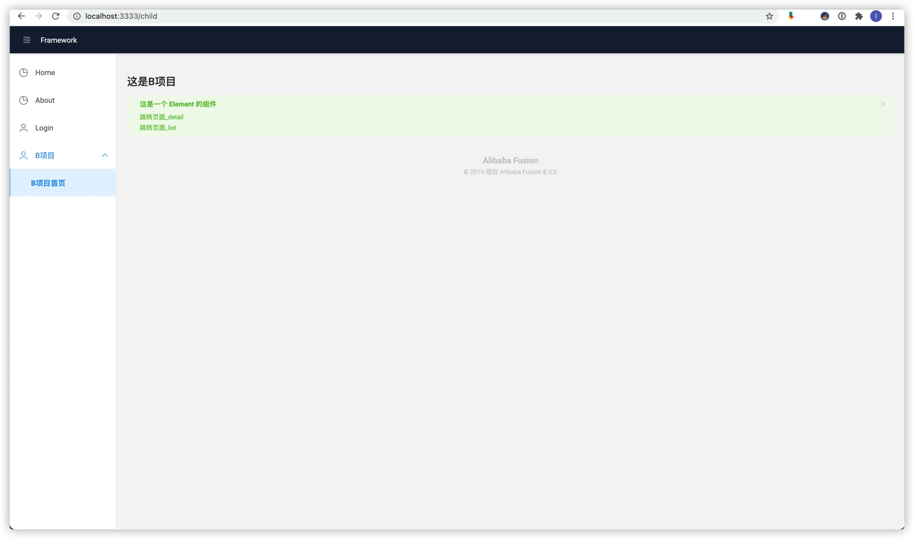
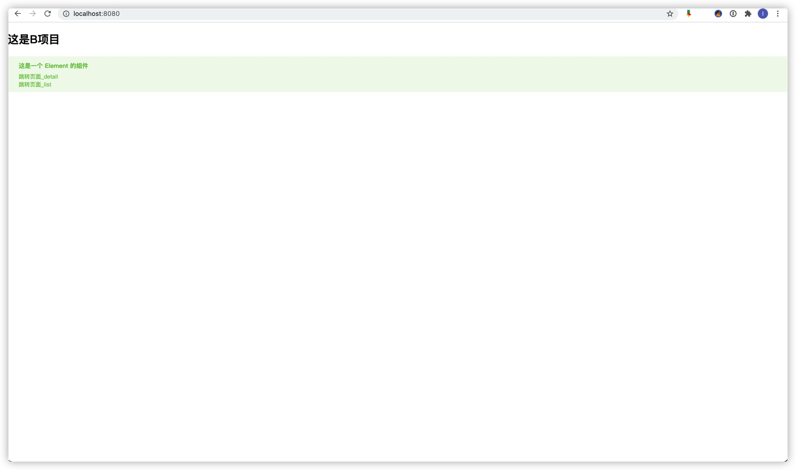

# 微前端icestark初体验

微前端是近几年前端领域比较新型的概念，特别是阿里，字节跳动等头部企业在内部越来越多使用各自研发的icestark,qiankun,garfish等解决方案之后。本文尝试从icestark着手，介绍一下微前端的使用。

## 前言

必须说明的是，任何一个新技术都是为了解决某个特定痛点而出现的，我们不能为了使用而使用的。首先了解一点，

> 设计系统的架构受制于产生这些设计的组织的沟通结构。 — M.Conway

这就是康威定律，而它几乎就是微前端（准确来说是微服务架构）的理论基础了。它指出了组织架构越庞大，其系统间沟通成本越高的问题。而解决这一问题的有效手段就是，将大的系统拆分成一个个微小的，可以独立自治的子系统。一旦系统的依赖限制在了内部，功能上更加内聚，对外部的依赖变少，那么就能显著的减少跨系统之间的沟通成本了。

所以本质上，微前端(微服务架构)关注的是如何解决组织和团队间协作带来的工程问题，而不是单纯的某个技术问题。

所以我们也就知道一般在哪些场合下，微前端是比较好的实践方案：

- 中大型web应用，多团队共建、多系统间相互集成、技术债务过重的项目
- 后台比较分散，体验差别大，因为要频繁跳转导致操作效率低，希望能统一收口的一个系统内

通俗来讲就是，旧的系统不能下，新的需求还在来，微前端能提供了一种类似动态插拔的机制。

如果你的系统各部件之间本身就是强耦合、自洽、不可分离，拆分的成本高于治理的成本，直接改造存量系统的收益大于新老系统混杂带来的问题。或者你的系统里的所有组件都是由一个小的团队开发的。那么其实可能你并不需要用到微前端这个技术。

## Let's go

下面我们以A，B两个项目为例使用icestark。其中A项目为主应用，B项目为微应用。主应用通过 icestark 管理微应用的注册和渲染，将整个系统彻底解耦。因此一般来说，主应用应该尽可能剥离业务，里面不应该有业务代码，而样式也不能够影响到微应用，应该在各自的微应用在来进行业务以及样式的处理。

为了演示微服务在不同框架中都能使用，A项目使用React，B项目使用Vue。A项目的项目名为"icestark-layout"，B项目的项目名为“icestark-child”。

### A项目主应用（React）

首先我们利用[飞冰](https://ice.work/)模板初始化A项目（用这种方式初始化项目后会安装icestark插件）。

```bash
# 基于 React 的主应用
$ npm init ice icestark-layout @icedesign/stark-layout-scaffold
$ cd icestark-layout
$ npm install
$ npm start
```

#### 配置

在主应用中，我们在应用入口(src/app.tsx)中进行配置appConfig

```typescript
import { runApp, IAppConfig } from 'ice';
import { ConfigProvider } from '@alifd/next';
import PageLoading from '@/components/PageLoading';
import FrameworkLayout from '@/layouts/FrameworkLayout';

const appConfig: IAppConfig = {
  icestark: {
    type: 'framework',
    Layout: FrameworkLayout,
    getApps: async () => {
      # 在这里配置子项目
      const apps = [{
        path: '/child',
        title: 'B项目',
        sandbox: true,
        # entry为子项目的入口,一般来说是.html结尾
        entry: '/api/', # entry: 'https://example.com/a.html',
      }];
      return apps;
    },
  },
};

runApp(appConfig);

```

其中最重要的是入口字段，可以是url或者entry

##### url

```typescript
const apps = [{
  url: ['https://example.com/a.js', 'https://example.com/a.css'],
  path: '/foo'
  // ...
}]
```

##### entry

```typescript
const apps = [{
  entry: 'https://example.com/a.html',
  path: '/foo'
  // ...
}]
```

在这里，我们设置入口`entry:'/api/'` 利用了代理，需要在项目根目录下的build.js进行配置，这样当访问/api时，其实访问的是`http://127.0.0.1:8080` ，也就是子项目暴露出来的地址。在开发阶段这种操作很常见，在实际部署时可以通过nginx在部署服务器上将`/api`代理到子项目构建后dist目录下的index.html

```json
{
  "proxy": {
      "/api": {
      "enable": true,
      "target": "http://127.0.0.1:8080",
      "pathRewrite": { "^/api": "" },
      "changeOrigin": true
    }
  },
  "plugins": [
    [
      "build-plugin-icestark",
      {
        "uniqueName": "frameworkJsonp"
      }
    ],
    [
      "build-plugin-fusion",
      {
        "themePackage": "@alifd/theme-design-pro",
        "themeConfig": {
          "nextPrefix": "next-icestark-"
        }
      }
    ]
  ]
}
```

配置完成后，则可以看到结果了（需要微应用B项目也完成先，至于B项目内容请看下一部分内容）



### B项目微应用（Vue）

首先还是利用飞冰模板初始化B项目，同样的用这种方式初始化项目会自动安装icestark插件使其成为一个微应用，如果你的项目已经处于开发之中，并且使用的是create-react-app等其他框架，可以查看官方 [其他框架接入微应用](https://micro-frontends.ice.work/docs/guide/use-child/others/) 文档来接入。

```bash
# 基于 Vue 的微应用
$ npm init ice icestark-child @vue-materials/icestark-child-app
$ cd icestark-child
$ npm install
$ npm run start
```

#### 开发示例

微应用开发就是一般正常的开发环节了，由于是Vue项目，我们在/src/pages下新建Child目录，并在其中开发组件

```vue
// /src/pages/Child/Child.vue

<template>
 <div>
   <h2>这是B项目</h2>
    <el-alert
      title="这是一个 Element 的组件"
      type="success"
    >
    <div><router-link to="/detail">跳转页面_detail</router-link></div>
    <div><router-link to="/list">跳转页面_list</router-link></div>
    </el-alert>
 </div>
</template>

<script>
 export default {
   name: 'Child',
   data () {
     return {

     }
   }
 }
</script>

<style scoped></style>
```

同时修改路由配置/src/config/route.js

```javascript
import { renderNotFound } from '@ice/stark-app';
import BasicLayout from '@/layouts/BasicLayout';
import List from '@/pages/List';
import Detail from '@/pages/Detail';
import Child from '@/pages/Child';

const routerConfig = [
  {
    path: '/',
    component: BasicLayout,
    children: [
      { path: '/', component: Child, exact: true },
      { path: '/list', component: List },
      { path: '/detail', component: Detail },
      {
        path: '*',
        component: () => renderNotFound(),
      },
    ],
  },
];
export default routerConfig;
```

完成之后，B项目微应用的效果如图

