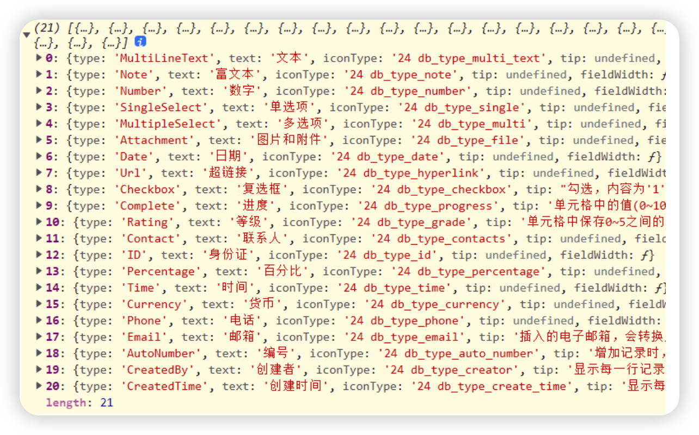
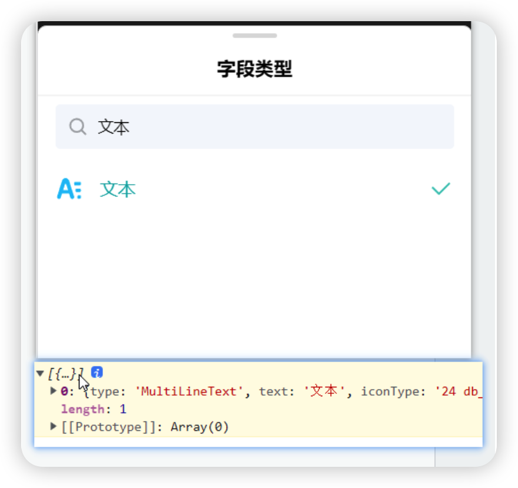
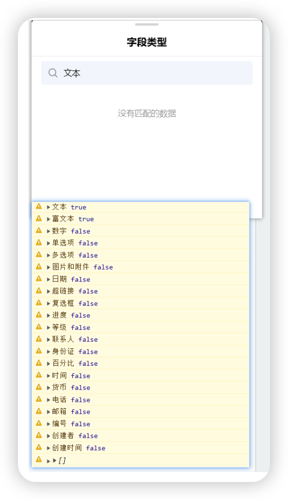
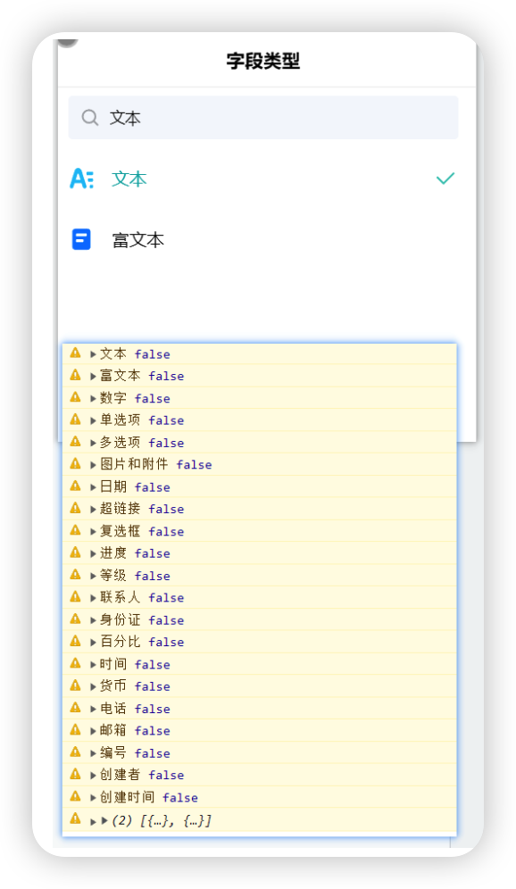
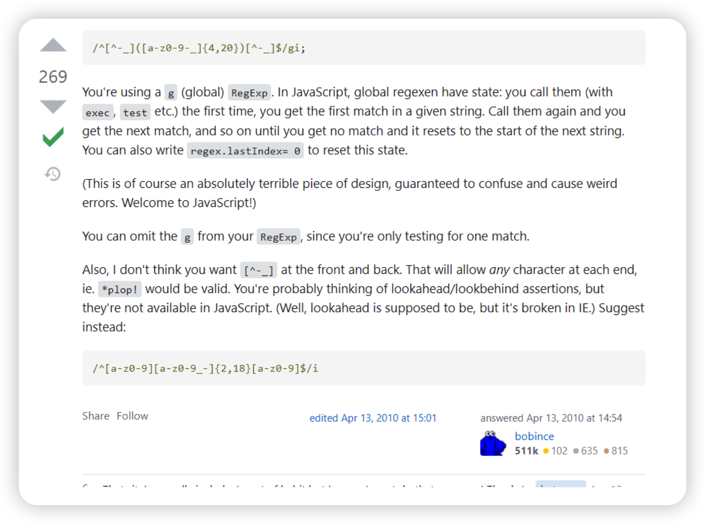
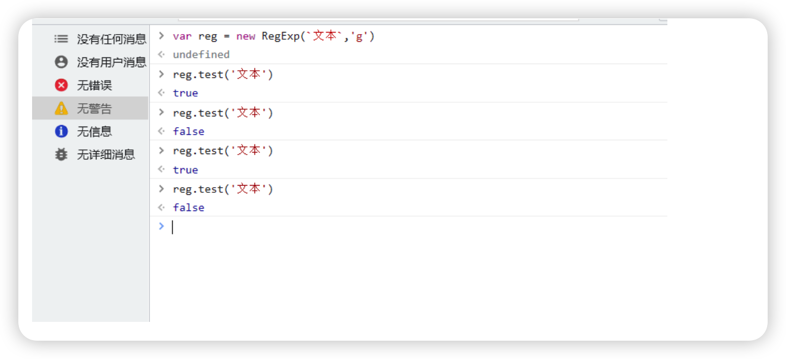
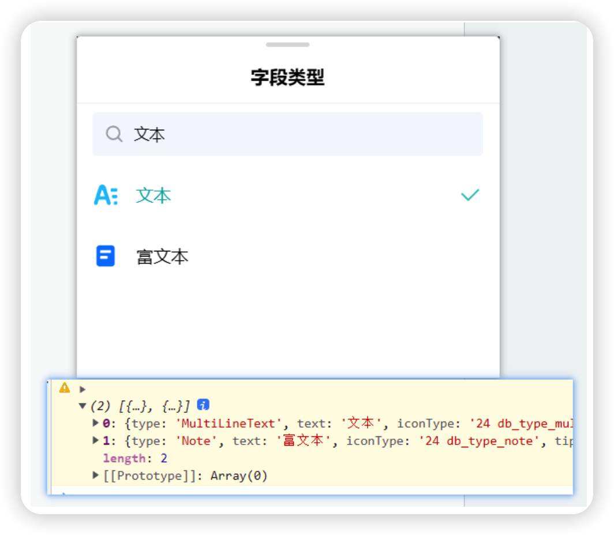

# 正则/g的匹配字符串问题

## 复现场景

先看一个例子

下面代码

```typescript
const reg = new RegExp(`${e.target.value}`,'g')
const searchItems = this.selectItems.filter(item => reg.test(item.text))
this.setState({selectItems: searchItems})
```

其中,this.selectItems是下图的结果。那么如果e.target.value输入文本，得到的filter的结果数组是什么?

结果只有一项：



把代码稍微改一下，找下其中的原因

```typescript
const reg = new RegExp(`${e.target.value}`,'g')
const searchItems = []
this.selectItems.forEach(item => {
    if (reg.test(item.text)) {
        searchItems.push(item);
    }
})
this.setState({selectItems: searchItems})
```

改成上面代码之后，最后的结果跟最初的代码是完全一致的

## log出现的问题

把上面第二段代码打一下console.warn

```typescript
const reg = new RegExp(`${e.target.value}`,'g')
const searchItems = []
this.selectItems.forEach(item => {
    console.warn(item.text, reg.test(item.text));    // 这一行是新增的
    if (reg.test(item.text)) {
        searchItems.push(item);
    }
})
console.warn(searchItems)    // 这一行看下得到的数组
this.setState({selectItems: searchItems})
```



诡异的现象出现了，console之后文本及富文本是true，但是if却没有进去，而且最后结果空数组也是如此

代码再修改一下

```typescript
const reg = new RegExp(`${e.target.value}`,'g')
const searchItems = []
this.selectItems.forEach(item => {
    if (reg.test(item.text)) {
        searchItems.push(item);
    }
    console.warn(item.text, reg.test(item.text));    // 这一行是新增的
})
console.warn(searchItems)    // 这一行看下得到的数组
this.setState({selectItems: searchItems})
```



***\*console的位置放在下面，得到的结果却是对的，然而reg.test(item.text)是false\****

***\*这是不是有点像“双缝干涉实验”？观察者效应表明，当你去盯着结果时（console），对结果就产生了影响\****

## 原因

根据[MDN](https://developer.mozilla.org/zh-CN/docs/Web/JavaScript/Reference/Global_Objects/RegExp/test)的说法，

如果正则表达式设置了全局标志，`test() `的执行会改变正则表达式   [`lastIndex`](https://developer.mozilla.org/en-US/docs/Web/JavaScript/Reference/Global_Objects/RegExp/lastIndex)属性。连续的执行`test()`方法，后续的执行将会从 lastIndex 处开始匹配字符串，([`exec()`](https://developer.mozilla.org/zh-CN/docs/Web/JavaScript/Reference/Global_Objects/RegExp/exec) 同样改变正则本身的 [`lastIndex`](https://developer.mozilla.org/en-US/docs/Web/JavaScript/Reference/Global_Objects/RegExp/lastIndex)`属性值`).

参考https://stackoverflow.com/questions/2630418/javascript-regex-returning-true-then-false-then-true-etc的一个解答



看到这里，相信你应该就能知道，为什么代码中console写在前后不同位置得到的结果也不一样了

直接在控制台也能复现复现现象



## 那么如何解决这个问题？

### 1.lastIndex = 0

```typescript
const searchItems = this.selectItems.filter(item => {
    const flag = reg.test(item.text)
    reg.lastIndex = 0    // 新增这一行
    return flag
})
```

### 2.或者用indexOf代替正则

```typescript
const searchInput = e.target.value.trim()
const searchItems = this.selectItems.filter(item => item.text.indexOf(searchInput) > -1)
this.setState({selectItems: searchItems})
```



### 3. 这个场景不用/g，直接去掉

DONE