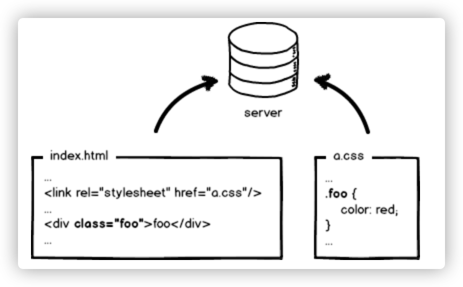
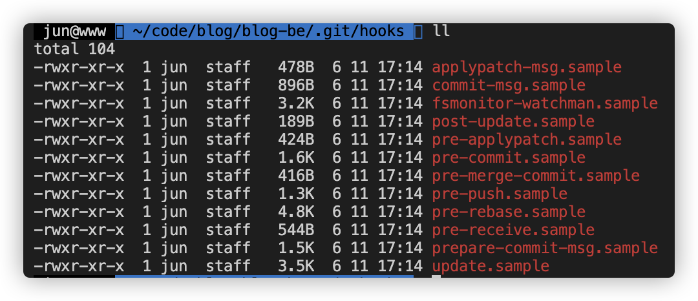

# 利用git hooks实现自动化部署

## 一般情况下的前端部署

首先让我们先进入时空裂缝，回到十几年前前端开发最原始的阶段。

我们手写了一个html文件和css的样式文件，然后把它们放进一个名为dist的文件夹内，把整个文件夹丢到服务器上，然后开启Nginx，指向dist文件夹，等待用户访问。以上就是最基础的前端部署。



当我们的项目复杂起来后，我们可能会借助wepack来模块化打包成bundle，或者用Vue/React来开发的前端项目的话，开完完毕之后会用npm run build/yarn build来完成这一目的，最后将构建后的dist文件夹同样丢到服务器上来完成前端部署。


那么问题来了，在我们每开发完一个feature，把代码push到上去之后，如果要在开发环境查看效果，难道也要手动build一次和把dist文件夹拷贝过去？现在我们一般都采用Git来管理代码，对于多人开发协作模式的情况下，我们会在已有分支（master/dev）下创建出自己的开发分支，本地开发测试后再合并到master/dev分支。**那么有没有一种方式可以做到，每次我们push最新的代码上去后，服务器就自动安装依赖，构建乃至重启服务呢？**

## 利用git hooks实现自动化部署

其实，当你用 `git init` 初始化一个新版本库时，Git 默认会在这个目录中放置一些示例脚本。 这些脚本除了本身可以被调用外，它们还透露了被触发时所传入的参数。 所有的示例都是 shell 脚本，其中一些还混杂了 Perl 代码，不过，任何正确命名的可执行脚本都可以正常使用 —— 你可以用 Ruby 或 Python，或任何你熟悉的语言编写它们。 这些示例的名字都是以 `.sample` 结尾，如果你想启用它们，得先移除这个后缀。



这里主要介绍两个钩子，官方地址：http://git-scm.com/docs/githooks

### post-update

> This hook is invoked by [git-receive-pack[1\]](http://git-scm.com/docs/git-receive-pack) when it reacts to `git push` and updates reference(s) in its repository. It executes on the remote repository once after all the refs have been updated.
>
> It takes a variable number of parameters, each of which is the name of ref that was actually updated.
>
> This hook is meant primarily for notification, and cannot affect the outcome of `git receive-pack`.
>
> The post-update hook can tell what are the heads that were pushed, but it does not know what their original and updated values are, so it is a poor place to do log old..new. The [post-receive](http://git-scm.com/docs/githooks#post-receive) hook does get both original and updated values of the refs. You might consider it instead if you need them.
>
> When enabled, the default post-update hook runs `git update-server-info` to keep the information used by dumb transports (e.g., HTTP) up to date. If you are publishing a Git repository that is accessible via HTTP, you should probably enable this hook.
>
> Both standard output and standard error output are forwarded to `git send-pack` on the other end, so you can simply `echo` messages for the user.

简单来说，这个钩子会在我们执行`git push`将代码推到git仓库，代码更新之后执行。同时携带了当前的ref作为参数。

比如说，我们在post-update中编写脚本

```bash
#!/bin/sh
echo $1
```

假设我们当前处于dev分支，那么当我们执行`git push origin dev`之后，会输出“refs/heads/dev”。

效果等同于

```bash
git push origin dev
sh ${path}/.git/hooks/post-update refs/heads/dev
```

所以我们可以在这个钩子脚本中执行连接项目所在的服务器，根据分支去拉取相应最新代码等操作

### post-merge

> This hook is invoked by [git-merge[1\]](http://git-scm.com/docs/git-merge), which happens when a `git pull` is done on a local repository. The hook takes a single parameter, a status flag specifying whether or not the merge being done was a squash merge. This hook cannot affect the outcome of `git merge` and is not executed, if the merge failed due to conflicts.
>
> This hook can be used in conjunction with a corresponding pre-commit hook to save and restore any form of metadata associated with the working tree (e.g.: permissions/ownership, ACLS, etc). See contrib/hooks/setgitperms.perl for an example of how to do this.

简单来说，这个钩子由git-merge调用，因此当我们在本地执行`git pull`之后也会调用，如果由于冲突导致合并失败，那么这个钩子则不会被调用

那么我们就可以在这个钩子脚本中执行安装模块，构建，拷贝文件等操作


### 实践

利用post-update以及post-merge两个钩子，我们就可以实现自动化部署了。

#### 在git服务器的项目代码仓库中编写post-update钩子脚本

```bash
#!/bin/sh

if [ $1 == "refs/heads/dev" ]
then
  unset GIT_DIR # 如果项目在本机，需要先unset GIT_DIR，否则将会因路径问题报错
  cd /home/fe  # 进入到开发环境项目路径，假设开发环境也在本机，路径为/home/fe
  git pull origin dev
elif [ $1 == "refs/heads/master" ]
then
    # 进入到master环境，假设master环境需要远程登陆,账号为master,ip为192.168.1.10,项目路径在/home/fe下
  ssh master@192.168.1.10 "cd '/home/fe' && git pull origin master"
fi
```

#### 在项目所在的服务器编写post-merge钩子脚本

```bash
#!/bin/sh

yarn # 安装依赖
yarn build # 构建项目
cp -rpv dist/* dest #拷贝文件到dest文件夹下，避免构建时影响旧系统
```

#### 这样每次当push代码到git仓库后，post-update钩子脚本就会执行，进入到项目所在服务器/路径自动执行`git pull`操作，而执行完毕之后，post-merge钩子脚本又会被调用，然后进行安装依赖，构建等操作