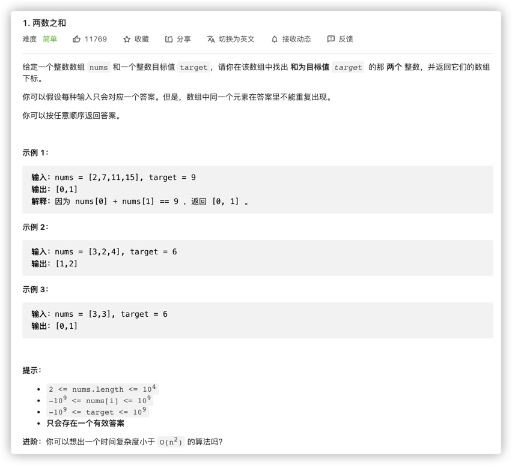

# [1-两数之和](https://leetcode-cn.com/problems/two-sum)

> 给定一个整数数组 nums 和一个整数目标值 target，请你在该数组中找出 和为目标值 target  的那 两个 整数，并返回它们的数组下标。
>
> 你可以假设每种输入只会对应一个答案。但是，数组中同一个元素在答案里不能重复出现。
>
> 你可以按任意顺序返回答案。
>
> 示例 1：
>
> ```
> 输入：nums = [2,7,11,15], target = 9
> 输出：[0,1]
> 解释：因为 nums[0] + nums[1] == 9 ，返回 [0, 1] 。
> ```
>
> 示例 2：
>
> ```
> 输入：nums = [3,2,4], target = 6
> 输出：[1,2]
> ```
>
> 示例 3：
>
> ```
> 输入：nums = [3,3], target = 6
> 输出：[0,1]
> ```
>
> 提示：
>
> - `2 <= nums.length <= 104`
> - `-109 <= nums[i] <= 109`
> - `-109 <= target <= 109`
> - **只会存在一个有效答案**
>
> 进阶：你可以想出一个时间复杂度小于 O(n2) 的算法吗？
>



## 方法一：暴力求解——O(N²)

```javascript
/**
 * @param {number[]} nums
 * @param {number} target
 * @return {number[]}
 */
var twoSum = function(nums, target) {
  for(let i = 0; i < nums.length; i++) {
    for(let j = i+1; j < nums.length; j++) {
      if(nums[i] + nums[j] === target) return [i,j]
    }
  }
};
```

## 方法二：HashMap——O(N)

```javascript
/**
 * @param {number[]} nums
 * @param {number} target
 * @return {number[]}
 */
var twoSum = function(nums, target) {
  let map = new Map()
  for(let i=0;i<nums.length;i++) {
    if(map.has(target-nums[i])) return [i, map.get(target-nums[i])]
    map.set(nums[i],i)
  }
};


//或者直接用一个对象
var twoSum = function(nums, target) {
  let obj={}
  for(let i=0;i<nums.length;i++) {
    if(target-nums[i] in obj) return [i, obj[target-nums[i]]]   		 //if(obj.hasOwnProperty(target-nums[i])) return [i, obj[target-nums[i]]]
    obj[nums[i]] = i
  }
};
```

