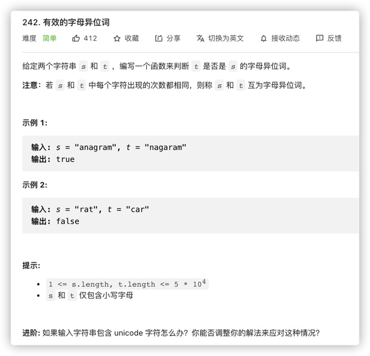

# [242-有效的字母异位词](https://leetcode-cn.com/problems/valid-anagram/)

> 给定两个字符串 s 和 t ，编写一个函数来判断 t 是否是 s 的字母异位词。
>
> 注意：若 s 和 t 中每个字符出现的次数都相同，则称 s 和 t 互为字母异位词。
>
> **提示:**
>
> - `1 <= s.length, t.length <= 5 * 104`
>- `s` 和 `t` 仅包含小写字母
> 
> **示例 1:**
>
> ```
>输入: s = "anagram", t = "nagaram"
> 输出: true
> ```



## 方法一：sort排序——O(NlogN)

```javascript
/**
 * @param {string} s
 * @param {string} t
 * @return {boolean}
 */
var isAnagram = function(s, t) {
  if(s.length !== t.length) return false
  let arr1 = s.split("").sort()
  let arr2 = t.split("").sort()
  for(let i = 0;i < arr1.length; i++) {
    if(arr1[i] !== arr2[i]) return false
  }
  return true
};
```

## 方法二：哈希表（Map）——O(N)

```javascript
/**
 * @param {string} s
 * @param {string} t
 * @return {boolean}
 */
var isAnagram = function(s, t) {
  if(s.length!==t.length) return false
  let map = new Map()
  for(let i=0;i<s.length;i++){
    map.set(s[i], (map.get(s[i]) +1 ) || 1)
  }
  for(let i=0;i<t.length;i++){
    map.set(t[i], (map.get(t[i]) - 1 ))
  }
  for(let item of map) {
    if(item[1] !== 0) return false
  }
  return true
};
```

或者直接用一个对象

```javascript
/**
 * @param {string} s
 * @param {string} t
 * @return {boolean}
 */
var isAnagram = function(s, t) {
  if(s.length !== t.length) return false
  let map = {}
  for(let i = 0;i < s.length; i++) {
    map[s[i]] = map[s[i]] + 1 || 1
  }
  for(let i = 0;i < t.length; i++) {
    map[t[i]] = map[t[i]] - 1
  }
  for(let item in map) {
    if(map[item] !== 0) return false
  }
  return true
};
```

