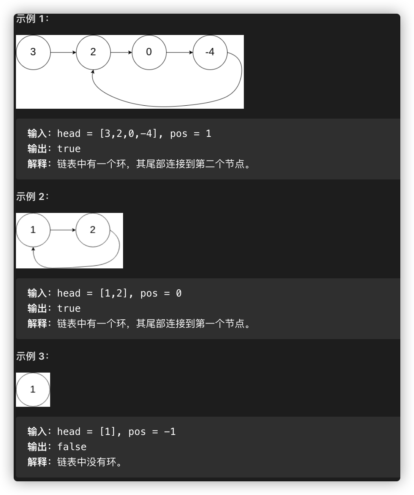

# [141-环形链表](https://leetcode-cn.com/problems/linked-list-cycle)

> 给定一个链表，判断链表中是否有环。
>
> 如果链表中有某个节点，可以通过连续跟踪 next 指针再次到达，则链表中存在环。 为了表示给定链表中的环，我们使用整数 pos 来表示链表尾连接到链表中的位置（索引从 0 开始）。 如果 pos 是 -1，则在该链表中没有环。注意：pos 不作为参数进行传递，仅仅是为了标识链表的实际情况。
>
> 如果链表中存在环，则返回 true 。 否则，返回 false 。
>
> 进阶：
>
> 你能用 O(1)（即，常量）内存解决此问题吗？



## 暴力解法（仅用于leetcode做题）

设定一个时间，比如在0.5s内，如果一个个找下去没有遇到空，则不是环

```javascript
/**
 * Definition for singly-linked list.
 * function ListNode(val) {
 *     this.val = val;
 *     this.next = null;
 * }
 */

/**
 * @param {ListNode} head
 * @return {boolean}
 */
var hasCycle = function(head) {
    let time = Date.now()
    while(head) {
      if(Date.now() - time ===500) return true
      head = head.next
    }
    return false
};
```


## Set/Map

用一个Set或者Map每走一步作记录,走到最后如果记录中没有，则false，有的话则true

```javascript
var hasCycle = function(head) {
  if(!head || !head.next) return false
  let set = new Set()
  while(head) {
    if(set.has(head)) return true
    set.add(head)
    head = head.next
  }
  return false
};
```

## 快慢指针（龟兔赛跑）

第一次做的话估计大部分人都不会想到这个办法，但我们可以站在巨人的肩膀上，学习他们的思路。方法是：

1. 假定一个快指针和慢指针最开始都指向头
2. 行动慢指针都走一步，快指针走两步
3. 判断两个指针是否相遇
4. 重复23步骤，当走到头都没相遇返回false

```javascript
var hasCycle = function(head) {
  let fast = head
  let slow = head
  while(slow && fast && fast.next) {
    slow = slow.next
    fast = fast.next.next
    if(slow === fast) return true
  }
  return false
};
```


```python
# Definition for singly-linked list.
# class ListNode(object):
#     def __init__(self, x):
#         self.val = x
#         self.next = None

class Solution(object):
    def hasCycle(self, head):
        """
        :type head: ListNode
        :rtype: bool
        """
        slow = fast = head
        while slow and fast and fast.next:
          slow = slow.next
          fast = fast.next.next
          if slow == fast:
            return True
        return False
```