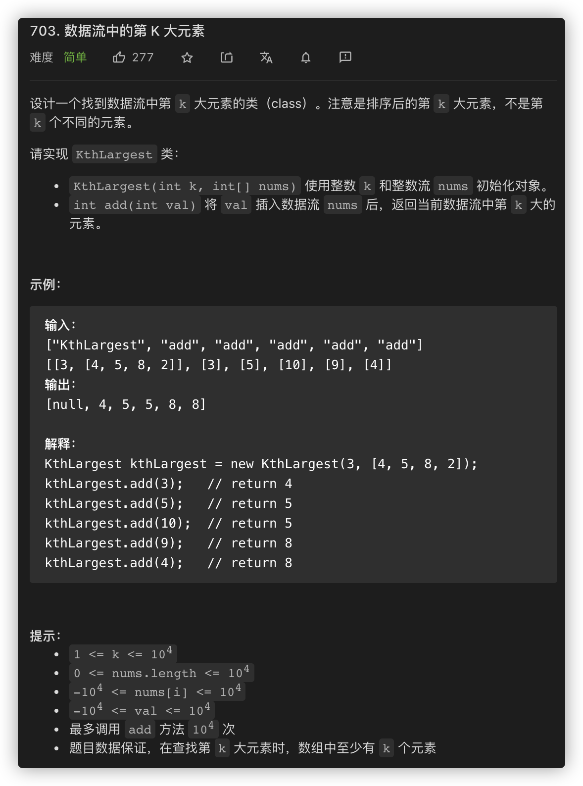

# [703-数据流中的第 K 大元素](https://leetcode-cn.com/problems/kth-largest-element-in-a-stream)

> 设计一个找到数据流中第 k 大元素的类（class）。注意是排序后的第 k 大元素，不是第 k 个不同的元素。
>
> 请实现 KthLargest 类：
> - KthLargest(int k, int[] nums) 使用整数 k 和整数流 nums 初始化对象。
> - int add(int val) 将 val 插入数据流 nums 后，返回当前数据流中第 k 大的元素。
> 
> 示例：
>
> ```
>输入：
> ["KthLargest", "add", "add", "add", "add", "add"]
>[[3, [4, 5, 8, 2]], [3], [5], [10], [9], [4]]
> 输出：
>[null, 4, 5, 5, 8, 8]
> 
> 解释：
> KthLargest kthLargest = new KthLargest(3, [4, 5, 8, 2]);
>kthLargest.add(3);  // return 4
> kthLargest.add(5);  // return 5
>kthLargest.add(10);  // return 5
> kthLargest.add(9);  // return 8
>kthLargest.add(4);  // return 8
> ```




## 暴力解法O(N*KlogK)

假如要找数据流中最大的元素，就只需要用一个max记录最大值，所有元素过一次后就找到了。

而当要找数据流中第K大的元素，就会想到需要记录数据流中前K大的元素。对K个元素进行排序是KlogK，最后的时间复杂度就是O(N*KlogK)


```javascript
/**
 * @param {number} k
 * @param {number[]} nums
 */
var KthLargest = function(k, nums) {
  this.k = k
  this.nums = nums.sort((a,b) => b-a).slice(0,k)
};

/** 
 * @param {number} val
 * @return {number}
 */
KthLargest.prototype.add = function(val) {
  if(this.nums.length < this.k) {
    this.nums.push(val)
    this.nums.sort((a,b) => b-a)
  } else {
    if(this.nums[this.k-1] < val) {
      this.nums[this.k-1] = val
      this.nums.sort((a,b) => b-a)
    }
  }
  return this.nums[this.k-1]
};

/**
 * Your KthLargest object will be instantiated and called as such:
 * var obj = new KthLargest(k, nums)
 * var param_1 = obj.add(val)
 */
```

## 优先队列

（由于js内置没有优先队列，所以用js的话需要先手动实现一个优先队列，这里仅提供参考）

复杂度分析

- 时间复杂度：

- - 初始化时间复杂度为：O(nlogk) ，其中 n为初始化时 nums 的长度；
  - 单次插入时间复杂度为：O(logk)。

- 空间复杂度：O(k)。需要使用优先队列存储前 k 大的元素。

由于js内置数据结构没有优先队列，所以需要自己实现，实现方式可以用堆/二叉搜索树（如果用java或者C++则不用）

```javascript
var KthLargest = function(k, nums) {
    this.k = k;
    this.heap = new MinHeap();
    for (const x of nums) {
        this.add(x);
    }
};

KthLargest.prototype.add = function(val) {
    this.heap.offer(val);
    if (this.heap.size() > this.k) {
        this.heap.poll();
    }
    return this.heap.peek();
};

class MinHeap {
    constructor(data = []) {
        this.data = data;
        this.comparator = (a, b) => a - b;
        this.heapify();
    }

    heapify() {
        if (this.size() < 2) return;
        for (let i = 1; i < this.size(); i++) {
        this.bubbleUp(i);
        }
    }

    peek() {
        if (this.size() === 0) return null;
        return this.data[0];
    }

    offer(value) {
        this.data.push(value);
        this.bubbleUp(this.size() - 1);
    }

    poll() {
        if (this.size() === 0) {
            return null;
        }
        const result = this.data[0];
        const last = this.data.pop();
        if (this.size() !== 0) {
            this.data[0] = last;
            this.bubbleDown(0);
        }
        return result;
    }

    bubbleUp(index) {
        while (index > 0) {
            const parentIndex = (index - 1) >> 1;
            if (this.comparator(this.data[index], this.data[parentIndex]) < 0) {
                this.swap(index, parentIndex);
                index = parentIndex;
            } else {
                break;
            }
        }
    }

    bubbleDown(index) {
        const lastIndex = this.size() - 1;
        while (true) {
            const leftIndex = index * 2 + 1;
            const rightIndex = index * 2 + 2;
            let findIndex = index;
            if (
                leftIndex <= lastIndex &&
                this.comparator(this.data[leftIndex], this.data[findIndex]) < 0
            ) {
                findIndex = leftIndex;
            }
            if (
                rightIndex <= lastIndex &&
                this.comparator(this.data[rightIndex], this.data[findIndex]) < 0
            ) {
                findIndex = rightIndex;
            }
            if (index !== findIndex) {
                this.swap(index, findIndex);
                index = findIndex;
            } else {
                break;
            }
        }
    }

  swap(index1, index2) {
        [this.data[index1], this.data[index2]] = [this.data[index2], this.data[index1]];
    }

    size() {
        return this.data.length;
    }
}
```

